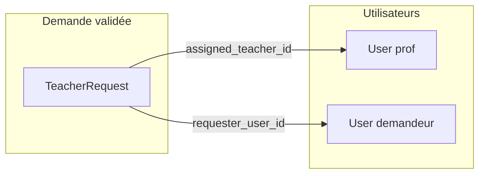

# Lier les demandes validées aux profs et compte demandeur

## Contexte actuel

- **[TeacherRequest](app/Models/TeacherRequest.php)** : demandeur (name, email, phone), critères (matiere_id, niveau_id, localisation), statut (pending, in_progress, completed, cancelled). Aucun lien avec un professeur ni avec un utilisateur.
- **Professeurs** : utilisateurs (User) avec rôle `teacher`, matières/niveaux via `matiere_user`, disponibilités via Zap ([TeacherAvailabilityService](app/Services/TeacherAvailabilityService.php)).
- **Création d’utilisateurs** : [UserService::createUser](app/Services/UserService.php) (name, email, password, roles). Pas de flux d’invitation existant ; Laravel envoie déjà des notifications de type « reset password » (tests présents).

## Architecture cible

- **Un seul professeur par demande** : clé étrangère `assigned_teacher_id` sur `teacher_requests`.
- **Compte demandeur optionnel** : clé étrangère `requester_user_id` sur `teacher_requests` + case à cocher « Créer un compte » avec envoi du lien de réinitialisation de mot de passe (pas de mot de passe temporaire).

---

## 1. Modèle de données

**Migration** (nouvelle) :

- `teacher_requests.assigned_teacher_id` : `nullable`, `foreignId()->constrained('users')->nullOnDelete()`.
- `teacher_requests.requester_user_id` : `nullable`, `foreignId()->constrained('users')->nullOnDelete()`.
- Optionnel : `teacher_requests.scheduled_at` (nullable, datetime) pour enregistrer un créneau prévu si besoin plus tard.

**Modèles** :

- **[TeacherRequest](app/Models/TeacherRequest.php)** : ajouter `assigned_teacher_id`, `requester_user_id` (et `scheduled_at` si retenu) dans `$fillable` ; relations `assignedTeacher()` → User, `requesterUser()` → User.
- **[User](app/Models/User.php)** : relations inverses `assignedTeacherRequests()`, `requesterTeacherRequests()` si utile pour les écrans (ex. fiche prof).

---

## 2. Assignation demande ↔ professeur

**Backend** :

- **[TeacherRequestController](app\Http\Controllers/Admin/TeacherRequestController.php)** (admin) :
  - Nouvelle action (ex. `assign` ou étendre `updateStatus` / nouvelle route dédiée) qui reçoit `teacher_id` (nullable pour désassigner), optionnellement `scheduled_at`, et `create_requester_account` (bool).
  - Règles : `teacher_id` nullable, `exists:users,id` et vérifier que l’utilisateur a le rôle teacher (ou via `UserService::getUsersWithRole('teacher')` côté liste).
  - Mise à jour de la demande : `assigned_teacher_id`, `scheduled_at`, et éventuellement passage du statut en `in_progress` ou `completed` selon la règle métier choisie.

**Frontend** :

- **[admin/teacher-requests/show](resources/js/pages/admin/teacher-requests/show.tsx)** :
  - Section « Assignation » : liste déroulante des professeurs (filtrée par matière/niveau de la demande si souhaité pour faciliter le choix).
  - Lien « Voir les disponibilités » vers la fiche du prof (route existante `admin.teachers.show` + onglet/URL disponibilités) ou ouverture de la page d’édition des dispos.
  - Optionnel : afficher un résumé des dispos du prof sélectionné (nécessite un endpoint ou des données chargées côté show).
  - Bouton « Enregistrer l’assignation » qui appelle la nouvelle route avec `teacher_id` (+ `scheduled_at` si présent).

**Données pour la liste des profs** :

- Sur la page show d’une demande : charger la liste des professeurs (déjà disponible via `UserService::getUsersWithRole('teacher')`). Optionnel : filtrer côté backend par `matiere_id` / `niveau_id` de la demande (requêtes sur `matiere_user`) et passer les profs filtrés + éventuellement leurs dispos à la vue pour affichage.

---

## 3. Disponibilités

- **Réutiliser l’existant** : les dispos sont gérées par [TeacherAvailabilityService](app/Services/TeacherAvailabilityService.php) et les pages admin prof (edit availability).
- Depuis la fiche demande : proposer un lien « Voir les disponibilités du professeur » vers `admin.teachers.availability.edit` (ou show) une fois un prof sélectionné ou assigné.
- Optionnel (phase ultérieure) : exposer une route API ou des props Inertia (ex. dans `show` de la demande) qui renvoient les dispos d’un `teacher_id` donné pour afficher un mini-calendrier ou liste de créneaux sur la page demande.

---

## 4. Création de compte pour le demandeur (lien reset)

**Règles** :

- Proposée uniquement si un professeur est assigné (ou au moment de l’assignation).
- Case à cocher « Créer un compte pour le demandeur » (nom + email déjà connus depuis la demande).
- Si cochée : créer un `User` avec name et email de la `TeacherRequest`, sans mot de passe (ou mot de passe aléatoire immédiatement invalidé), lui attribuer le rôle **parent**, puis déclencher l’envoi du lien de réinitialisation de mot de passe (comportement standard Laravel/Fortify).
- Lier ce user à la demande : `teacher_requests.requester_user_id = user->id`.
- Gérer le cas « email déjà existant » : ne pas créer de doublon ; soit afficher un message et seulement lier l’utilisateur existant à la demande (`requester_user_id`), soit envoyer quand même le lien reset à cet utilisateur.

**Backend** :

- **Service dédié** (recommandé) : ex. `TeacherRequestAssignmentService` ou méthode dans un `RequesterAccountService` :
  - `assignTeacher(TeacherRequest $request, ?int $teacherId, ?\Carbon\Carbon $scheduledAt = null): void`
  - `createRequesterAccountIfRequested(TeacherRequest $request, bool $createAccount): void`  
    - Si `createAccount` : vérifier si un user avec cet email existe ; si oui, l’assigner comme `requester_user_id` et envoyer le lien reset ; si non, créer le user (sans mot de passe ou avec password temporaire hashé puis invalider), assigner le rôle parent, envoyer le lien reset, définir `requester_user_id`.
- Envoi du lien reset : utiliser `Password::sendResetLink(['email' => $user->email])` (Laravel) ou le facade/helper équivalent du projet.

**Frontend** :

- Dans le formulaire d’assignation (page show) : case à cocher « Créer un compte pour le demandeur et lui envoyer un lien pour définir son mot de passe ».
- Envoi dans la requête : `create_requester_account: true/false`.

---

## 5. Routes et permissions

- **Nouvelle route admin** (dans [routes/admin.php](routes/admin.php)) :  
  - Ex. `POST` ou `PATCH` `teacher-requests/{id}/assign` → `TeacherRequestController@assign` (ou nom d’action choisi).
- Garder le middleware actuel (auth, verified, admin).

---

## 6. Fichiers à créer ou modifier (résumé)

| Fichier                            | Action                                                                                                            |
| ---------------------------------- | ----------------------------------------------------------------------------------------------------------------- |
| Nouvelle migration                 | Ajouter `assigned_teacher_id`, `requester_user_id` (et optionnellement `scheduled_at`) à `teacher_requests`       |
| `TeacherRequest` (model)           | Fillable + relations `assignedTeacher`, `requesterUser`                                                           |
| `User` (model)                     | Relations inverses optionnelles                                                                                   |
| `TeacherRequestController` (admin) | Méthode assign + appel service (assignation + création compte si demandé)                                         |
| Service (nouveau)                  | Logique assignation + création compte + envoi lien reset                                                          |
| `admin/teacher-requests/show.tsx`  | Section assignation (select prof, lien dispos, checkbox compte, submit)                                           |
| `routes/admin.php`                 | Route `assign` pour teacher-requests                                                                              |
| Types TS `TeacherRequest`          | Ajouter `assigned_teacher_id`, `requester_user_id`, `assigned_teacher?`, `requester_user?` si utilisés côté front |

---

## 7. Ordre de mise en œuvre suggéré

1. Migration + mise à jour des models (TeacherRequest, User).
2. Service d’assignation et création de compte + envoi du lien reset.
3. Route et contrôleur (TeacherRequestController@assign).
4. Page show : section assignation (select prof, lien dispos, checkbox compte, enregistrement).
5. Types TypeScript et chargement des profs (et optionnellement des dispos) sur la page show.

Aucun changement n’est nécessaire sur la gestion des disponibilités des profs (TeacherAvailabilityService / Zap) ; il s’agit uniquement de les consulter (lien ou données en lecture) pour choisir le professeur assigné.
